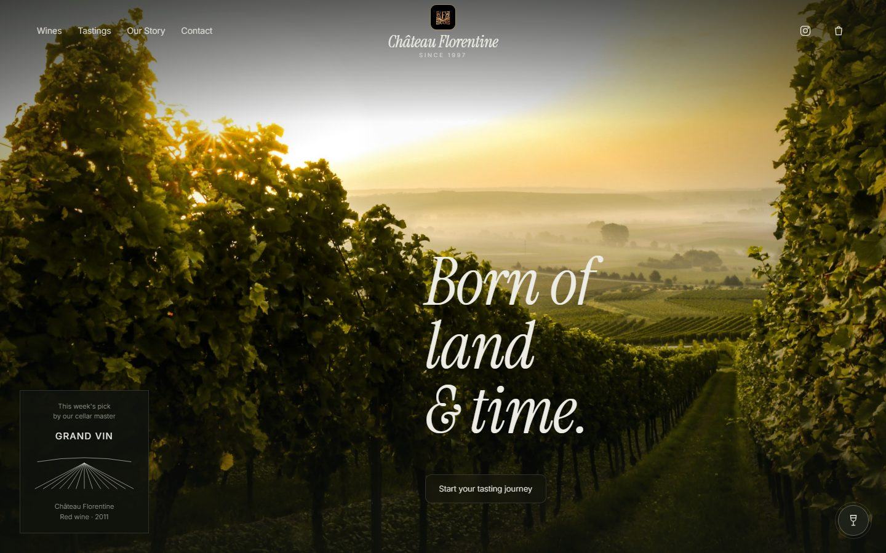

# Château Florentine: Winery Website Concept

A single-page website concept for Château Florentine, a family winery in
Majdel Meouch (Chouf, Lebanon). Built as a design demo to show the winery how
its story, wines and tastings could be presented online.



## Features

- Full-screen hero with a featured "wine of the week" card
- Wine collection with bottle and scene imagery for each wine
- Story section about the château and the woman it is named after
- Photo collage with pointer-driven interaction
- Tastings and visit section with map, WhatsApp and Instagram links
- Scroll-triggered reveal animations that respect `prefers-reduced-motion`
- Responsive layout for desktop, tablet and phone

## Tech Stack

- Plain HTML, CSS and JavaScript in one `index.html`
- No build step, no framework, no dependencies
- Google Fonts for typography

## Getting Started

Open `index.html` in a browser, or serve the folder locally:

```bash
git clone https://github.com/elias-khalil-eng/chateau-florentine-demo.git
cd chateau-florentine-demo
python -m http.server 8000
```

Then visit http://localhost:8000.

## Project Structure

```
index.html   Markup, styles and scripts
img/         Bottle shots and photography
docs/        README screenshot
```

## Note

This is an unofficial concept, not the winery's official website. Winery
name, logo and wine names belong to their owners. Photos are included for
demonstration only and are not covered by the license below.

## License

Code is released under the [MIT License](LICENSE).
